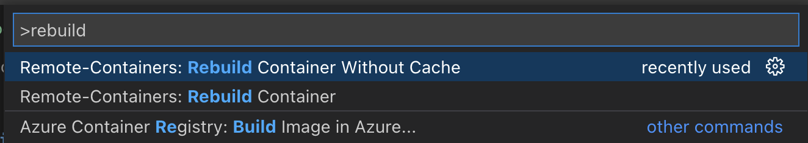
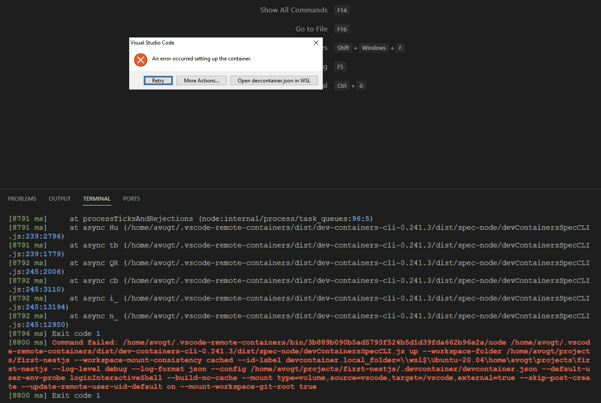
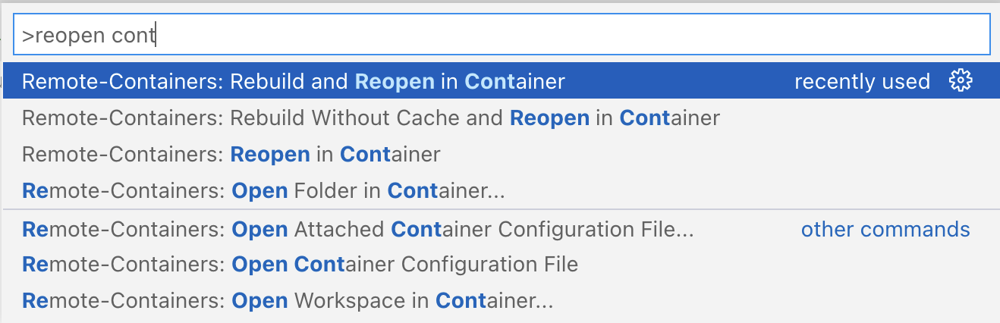

## 

## vscode fails to build/rebuild Devcontainer

* Problem: you try to rebuild the devcontainer from scratch with <kbd>CMD</kbd>-<kbd>SHIFT</kbd>-<kbd>P</kbd> and then `Rebuild Container Without Cache`

  * 

* error that happens:

* Solution: 
  *  <kbd>CMD</kbd>-<kbd>SHIFT</kbd>-<kbd>A</kbd> and then `Reopen in Container`

     

  * as an alternative, this will work as well: <kbd>CMD</kbd>-<kbd>SHIFT</kbd>-<kbd>A</kbd> and then `Rebuild and Reopen in Container`
  * > *do not use* `Rebuild Without Cache and Reopen in Container` since that exactly was causing the problem!
    > * the cache deletion was successful, but the rebuild got out of sync with the intermediate cache containers