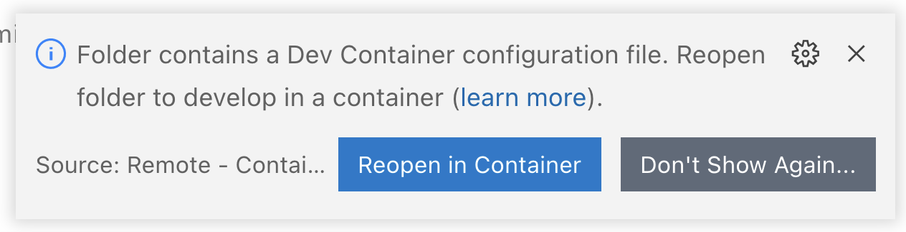
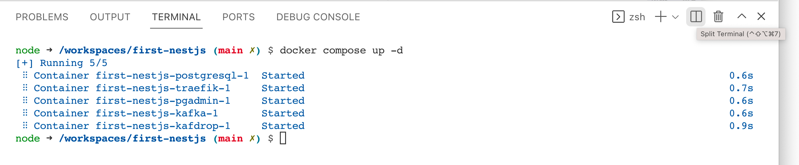
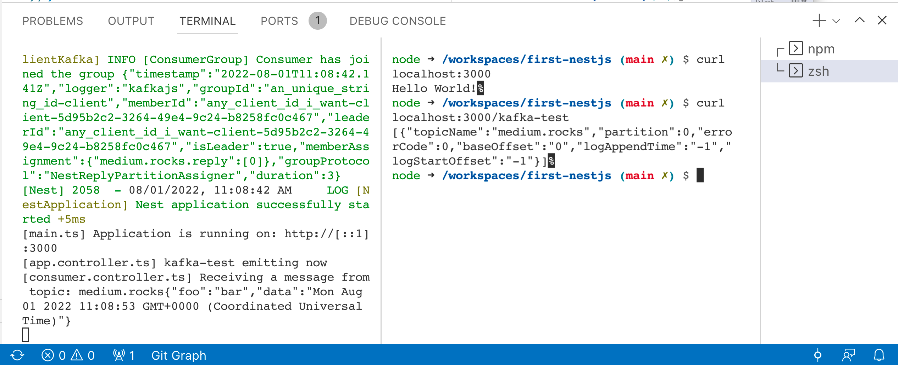

# Ein Kafka Producer und Consumer mit NestJS

## Ausprobieren in Visual Studio Code

```bash
git clone <project>
cd first-nestjs
code .
```

Open in Devcontainer !
   

Dann

1. falls nicht sichtbar, ein Terminal (Menü *Terminal*/*New Terminal*) öffnen,
1. die Docker Container starten

   ```bash
   docker compose up -d
   ```

1. das Terminal teilen (zwei Terminals)

   


1. Bauen und ausprobieren
   

   - linkes Terminal:

      ```bash
      npm installco
      npm run start:dev
      #
      #> nest-typescript-starter@1.0.0 start
      #> nest start
      #
      #[Nest] 1892  - 08/01/2022, 10:31:45 AM     LOG [NestFactory] #Starting Nest application...
      ```

   - rechtes Terminal:

      ```bash
      curl localhost:3000 
      # Hello World!%                    
      curl localhost:3000/kafka-test
      # [{"topicName":"medium.rocks","partition":0,"errorCode":0,"baseOffset":"0","logAppendTime":"-1","logStartOffset":"-1"}]%
      # ...
      # [main.ts] Application is running on: http://[::1]:3000            
      ```

   Durch den zweiten `curl` Aufruf wird ein event erzeugt und gleich auch konsumiert, im linken Terminal erscheint:

   ```bash
   [app.controller.ts] kafka-test emitting now
   [consumer.controller.ts] Receiving a message from topic: medium.rocks{"foo":"bar","data":"Mon Aug 01 2022 10:32:16 GMT+0000 (Coordinated Universal Time)"}
   ```

## Der Code

- Der get Endpunkt `/kafka-test` ist in [app.controller.ts](./src/app.controller.ts) implementiert.

- Der Event Consumer ist in [consumer.controller.ts](./src/consumer.controller.ts) implementiert.

Zum NestJS Framework:

- [README-nest.js]()

Aufbau des Projekts:

- [README-npm.js]()
